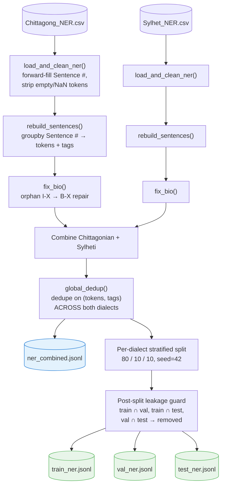
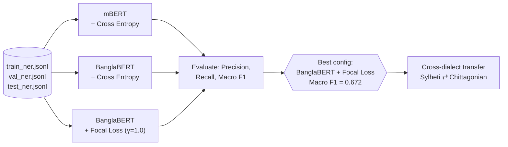
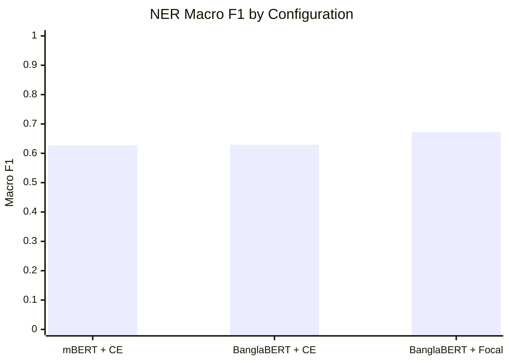
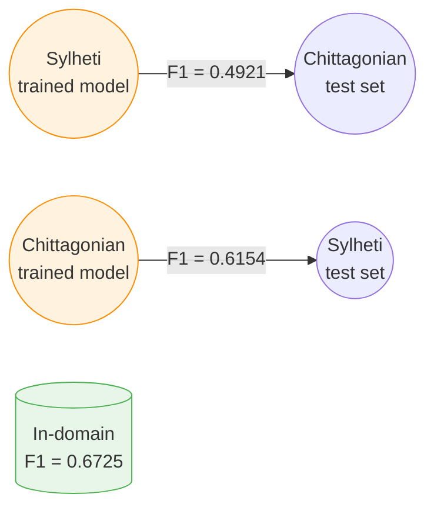

# Sylheti & Chittagonian Named Entity Recognition (NER)

**Dialect-aware Named Entity Recognition pipeline**, built as the discriminative-NLP half of the B.Sc. thesis *"A Unified Multi-Task Benchmark for Generative and Discriminative NLP on Low-Resource Bangla Dialects"* (Patuakhali Science and Technology University, Aug 2026).

This pipeline reconstructs sentence-level, BIO-tagged data from the **ANCHOLIK-NER** dataset for the **Sylheti** and **Chittagonian** dialects, applies global cross-dialect deduplication and leakage guards, and produces train/val/test splits used to train and compare **mBERT**, **BanglaBERT**, and **BanglaBERT + Focal Loss** token-classification models.

> 🔗 Companion project: [`M-T/`](../M-T/) — the generative-NLP (dialect → Standard Bangla Machine Translation) half of the same thesis.

---

## Table of Contents

- [Key Results](#key-results)
- [Pipeline Architecture](#pipeline-architecture)
- [Dataset](#dataset)
- [BIO Tagging Scheme](#bio-tagging-scheme)
- [NER Framework](#ner-framework)
- [Results](#results)
  - [Overall Model Comparison](#1-overall-ner-performance-comparison)
  - [Effect of Focal Loss](#2-effect-of-focal-loss)
  - [Entity-Level Performance](#3-entity-level-performance-banglabert--focal-loss)
  - [Cross-Dialect Transfer](#4-cross-dialect-transfer-analysis)
- [Error Analysis](#error-analysis)
- [Repository Structure](#repository-structure)
- [Usage](#usage)
- [Reproducibility](#reproducibility)
- [Citation](#citation)

---

## Key Results

| Model | Precision | Recall | Macro F1 |
|---|---|---|---|
| mBERT + Cross Entropy | 0.626 | 0.664 | 0.627 |
| BanglaBERT + Cross Entropy | 0.634 | 0.661 | 0.629 |
| **BanglaBERT + Focal Loss** | **0.649** | **0.719** | **0.672** |

Switching the encoder from mBERT → BanglaBERT contributes **+0.005** Macro F1; switching the loss from Cross Entropy → Focal Loss contributes **+0.044** Macro F1 — the optimization strategy matters roughly **8× more** than the encoder choice on this imbalanced, low-resource dataset.

---

## Pipeline Architecture



### Model Training & Evaluation Flow



---

## Dataset

| Dataset | Task | Coverage | Purpose |
|---|---|---|---|
| **ANCHOLIK-NER** | NER | Regional Bangla dialects (Sylheti, Chittagonian subset used here) | Token-level entity annotation |

The original ANCHOLIK dataset spans five regional dialects; this study uses only the **Sylheti** and **Chittagonian** subsets, chosen for their strong phonetic and grammatical divergence from Standard Bangla.

**Final dataset (after sentence reconstruction, BIO alignment, global dedup, and leakage guards):**

| Split | Sentences |
|---|---|
| Training | 4,645 |
| Validation | 671 |
| Test | 673 |
| **Total** | **5,989** |

**Entity categories (9 total):**

| Category | Meaning | Train Token Count |
|---|---|---|
| REL | Relation | 1,099 |
| LOC | Location | 619 |
| OBJ | Object | 537 |
| FOOD | Food | 502 |
| COL | Collective/Color* | 216 |
| ORG | Organization | 210 |
| ROLE | Role | 169 |
| ANI | Animal | 81 |
| PER | Person | 50 |

*The heavy skew toward `REL`, `LOC`, `OBJ`, and `FOOD` versus the scarce `PER`, `ANI`, and `ROLE` categories is the direct motivation for using Focal Loss instead of plain Cross Entropy.

---

## BIO Tagging Scheme

Each token is labeled **B**eginning, **I**nside, or **O**utside an entity span:

| Token | Label |
|---|---|
| ঢাকা | B-LOC |
| শহর | I-LOC |
| রহমান | B-PER |

An **orphan-tag repair step** (`fix_bio()`) automatically corrects malformed sequences — e.g. an `I-X` tag appearing at the start of a sentence, right after an `O`, or right after a *different* entity type — by converting it to `B-X`, guaranteeing BIO-consistent training data.

---

## NER Framework

Three transformer-based token-classification configurations are compared:

1. **mBERT + Cross Entropy** — multilingual baseline (100+ languages), tests cross-lingual transfer without Bengali-specific pretraining.
2. **BanglaBERT + Cross Entropy** — Bengali-specific pretraining, same loss, isolates the effect of language-specific representations.
3. **BanglaBERT + Focal Loss** — same encoder as (2), isolates the effect of imbalance-aware optimization.

| Parameter | Value |
|---|---|
| Encoder Models | mBERT, BanglaBERT |
| Loss Functions | Cross Entropy, Focal Loss |
| Max Sequence Length | 128 |
| Batch Size | 16 |
| Learning Rate | 2 × 10⁻⁵ |
| Early Stopping | Enabled |
| Selection Metric | Macro F1-score |
| Seed | 4238 |
| Focal Loss γ | 1.0 (+ inverse-frequency class smoothing) |

---

## Results

### 1. Overall NER Performance Comparison

| Model | Precision | Recall | Macro F1 |
|---|---|---|---|
| mBERT + CE | 0.626 | 0.664 | 0.627 |
| BanglaBERT + CE | 0.634 | 0.661 | 0.629 |
| **BanglaBERT + Focal Loss** | **0.649** | **0.719** | **0.672** |



### 2. Effect of Focal Loss

| Design Choice | Δ Macro F1 |
|---|---|
| Encoder: mBERT → BanglaBERT | +0.0054 |
| Loss: Cross Entropy → Focal | **+0.0444** |

Focal loss down-weights easy, majority-class (`O`) tokens and up-weights hard/minority-class entity tokens, giving the largest single-lever improvement observed in this study — larger than switching the entire encoder architecture.

### 3. Entity-Level Performance (BanglaBERT + Focal Loss)

| Entity | F1-score | Train Support (n) |
|---|---|---|
| COL | 0.865 | 17 |
| FOOD | 0.857 | 49 |
| ORG | 0.756 | 25 |
| REL | 0.747 | 112 |
| LOC | 0.714 | 44 |
| OBJ | 0.683 | 51 |
| PER | 0.667 | 7 |
| ANI | 0.400 | 12 |
| ROLE | 0.364 | 11 |

High-support categories (COL, FOOD, ORG) achieve strong F1; low-support categories (ANI, ROLE) lag well behind, showing that focal loss helps but cannot fully compensate for very small sample counts.

### 4. Cross-Dialect Transfer Analysis

Using the best configuration (BanglaBERT + Focal Loss):

| Training → Testing | Macro F1 |
|---|---|
| In-domain (train & test same dialect mix) | 0.6725 |
| Sylheti → Chittagonian | 0.4921 |
| Chittagonian → Sylheti | 0.6154 |



Transfer is **asymmetric**: Chittagonian → Sylheti generalizes noticeably better than the reverse direction, and both cross-dialect settings fall well short of in-domain performance — evidence that Sylheti and Chittagonian, while related, need dialect-specific adaptation rather than a single shared model.

---

## Error Analysis

| Error Category | Description |
|---|---|
| Class imbalance | Rare entity categories (ANI, ROLE, PER) are harder to recognize |
| Vocabulary variation | Different dialect spellings/forms of similar expressions |
| Boundary detection | Incorrect entity span start/end identification |
| Context ambiguity | Misclassification from insufficient surrounding context |

`ANI` and `ROLE` show the weakest performance, directly tracking their low training-sample counts (12 and 11 respectively). Recommended next steps: broaden annotation coverage for rare classes, increase dataset diversity, and explore data augmentation for minority entity types.

---

## Repository Structure

```
N-E-R/
├── .gitignore
├── README.md
├── requirements.txt
│
├── data_raw/                          # place Chittagong_NER.csv, Sylhet_NER.csv here
│   ├── Chittagong_NER.csv
│   └── Sylhet_NER.csv
│
├── data_processed/                    # generated by scripts/run_ner_pipeline.py
│   ├── train_ner.jsonl
│   ├── val_ner.jsonl
│   ├── test_ner.jsonl
│   └── check_ner.py                   # sanity-check script: validates BIO/JSONL schema
│
├── scripts/
│   ├── 01_prepare_ner.py
│   ├── run_ner_pipeline.py            # single entry point for the data pipeline
│   └── utils_ner.py                   # JSONL validator, orchestrator
│
├── notebook/
│   └── bangla-dialect-ner-training.ipynb   # mBERT / BanglaBERT / Focal Loss training + cross-dialect transfer
│
├── results/                           # raw metric JSONs (source of truth for all tables above)
│   ├── mbert_ner_results.json
│   ├── bb_ce_ner_results.json
│   ├── bb_focal_ner_results.json
│   ├── all_models_per_dialect_results.json
│   ├── transfer_results.json
│   └── ner results framing.txt
│
└── figures/
    ├── dataset_ner_split_sizes.png
    ├── dataset_ner_dialect_balance.png
    ├── ner_per_class_f1.png
    ├── ner_per_dialect_comparison.png
    ├── ner_ablation_effects.png
    ├── ner_confusion_matrix.png
    ├── ner_transfer_comparison.png
    ├── ner_qualitative_examples.png
    ├── ner_tsne_by_class.png
    ├── ner_tsne_by_dialect.png
    ├── ner_attention_heatmap_example1.png
    ├── ner_attention_heatmap_example2.png
    ├── ner_attention_heatmap_example3.png
    ├── ner_saliency_example1.png
    ├── ner_saliency_example2.png
    └── ner_saliency_example3.png
```

## Usage

Run from the project root (`N-E-R/`):

```bash
pip install -r requirements.txt
python scripts/run_ner_pipeline.py
```

This regenerates `data_processed/train_ner.jsonl`, `val_ner.jsonl`, and `test_ner.jsonl`. Use `data_processed/check_ner.py` afterward to validate the output (BIO consistency, schema, leakage checks).

Model training and cross-dialect transfer are run separately via `notebook/bangla-dialect-ner-training.ipynb` (GPU recommended — originally run on a Kaggle T4):

```
notebook/bangla-dialect-ner-training.ipynb
  → trains mBERT+CE, BanglaBERT+CE, BanglaBERT+Focal Loss
  → writes results/mbert_ner_results.json, bb_ce_ner_results.json, bb_focal_ner_results.json
  → runs Sylheti⇄Chittagonian cross-dialect transfer → results/transfer_results.json
```

## Reproducibility

- Dataset split seed: **42**
- Model training seed: **4238**
- **Global cross-dialect deduplication** on `(tokens, tags)` before splitting
- **Post-split leakage guards**: train ∩ val, train ∩ test, and val ∩ test are explicitly checked and cleaned
- Automatic BIO-sequence repair (`fix_bio()`) ensures zero malformed tag sequences


**Dataset used:**
- ANCHOLIK-NER: A Dialect-Aware Bangla Named Entity Recognition Dataset — DOI: [10.17632/gbkszkt8z3.4](https://data.mendeley.com/datasets/gbkszkt8z3/4)